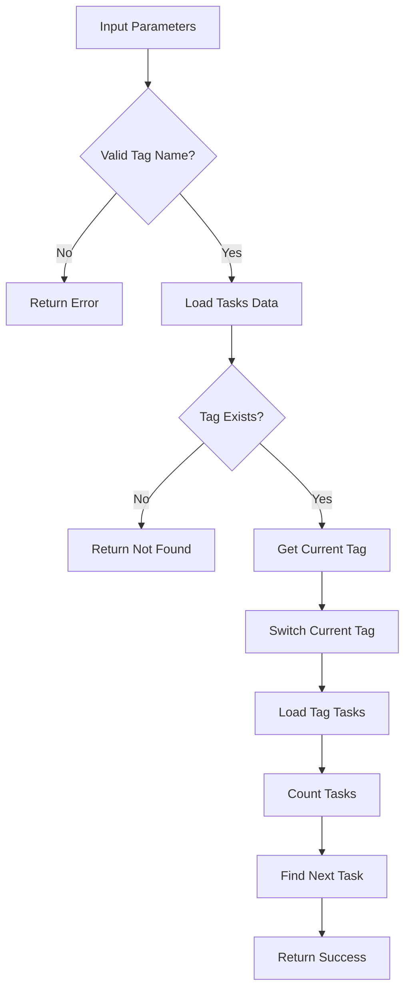

# Tool: use_tag

## Purpose
Switch the current active tag context to work with a different set of tasks without losing progress in other tags.

## Business Value
- **Who uses this**: Developers switching between features, bug fixes, or different work contexts
- **What problem it solves**: Enables seamless context switching between parallel work streams
- **Why it's better than manual approach**: Maintains task state across tags and automatically identifies next available task

## Functionality Specification

### Input Requirements

| Parameter | Type | Required | Default | Description |
|-----------|------|----------|---------|-------------|
| `name` | string | Yes | - | Name of the tag to switch to |
| `file` | string | No | "tasks/tasks.json" | Path to tasks file |
| `projectRoot` | string | Yes | - | Absolute path to project directory |

#### Validation Rules
1. Tag name must be provided and must be a string
2. Tag must exist in the system
3. Updates current tag setting in configuration
4. Loads tasks specific to the selected tag

### Processing Logic

#### Step-by-Step Algorithm

```
1. VALIDATE_TAG_NAME
   - Check tag name provided
   - Verify is string type
   
2. LOAD_TASKS_DATA
   - Read tasks.json file
   - Extract raw tagged data
   
3. VERIFY_TAG_EXISTS
   - Check tag exists in data
   - Return error if not found
   
4. GET_CURRENT_TAG
   - Store previous tag name
   - For reporting switch details
   
5. SWITCH_CURRENT_TAG
   - Update config.json
   - Set new current tag
   
6. LOAD_TAG_TASKS
   - Read tasks for new tag
   - Count available tasks
   
7. FIND_NEXT_TASK
   - Identify next available task
   - Consider status and dependencies
   
8. RETURN_SWITCH_DETAILS
   - Previous tag name
   - New current tag
   - Task count and next task
```

### Output Specification

#### Success Response
```javascript
{
  success: true,
  data: {
    tagName: "feature-auth",
    switched: true,
    previousTag: "master",
    taskCount: 15,
    nextTask: {
      id: "1.2",
      title: "Implement JWT authentication",
      status: "pending"
    },
    message: "Successfully switched to tag \"feature-auth\""
  }
}
```

#### Success Response (No Tasks)
```javascript
{
  success: true,
  data: {
    tagName: "bugfix-123",
    switched: true,
    previousTag: "feature-auth",
    taskCount: 0,
    nextTask: null,
    message: "Successfully switched to tag \"bugfix-123\""
  }
}
```

#### Error Response
```javascript
{
  success: false,
  error: {
    code: "TAG_NOT_FOUND",
    message: "Tag \"feature-xyz\" does not exist"
  }
}
```

#### Error Codes
- `MISSING_ARGUMENT`: Required parameters not provided
- `MISSING_PARAMETER`: Tag name not provided
- `TAG_NOT_FOUND`: Tag doesn't exist
- `USE_TAG_ERROR`: General error during tag switch

### Side Effects
1. **Updates current tag** in `.taskmaster/config.json`
2. All subsequent task operations use the new tag
3. Does not modify task data
4. Previous tag remains unchanged
5. Session context updated

## Data Flow



## Implementation Details

### Data Storage
- **Input**: `.taskmaster/tasks/tasks.json` - Tagged task data
- **Config**: `.taskmaster/config.json` - Current tag setting
- Current tag stored as string in config
- Tasks remain in their respective tags

### Current Tag Configuration
```javascript
// config.json structure
{
  "currentTag": "feature-auth",
  // other configuration...
}
```

### Next Task Algorithm
```javascript
function findNextTask(tasks) {
  // Priority order:
  // 1. In-progress tasks (continue work)
  // 2. Pending tasks with no dependencies
  // 3. Pending tasks with met dependencies
  return tasks.find(task => 
    task.status === 'in-progress' ||
    (task.status === 'pending' && !hasUnmetDependencies(task))
  );
}
```

### Tag Context
After switching:
- All task operations (add, update, list) operate on the new tag
- Tasks in other tags remain unchanged
- Can switch back to any tag at any time

## AI Integration Points
This tool **does not use AI**. It performs pure data operations:
- Configuration update
- Task loading and counting
- Next task identification
- No content generation or analysis

## Dependencies
- **File System Access**: Read/write JSON files
- **Tag Management**: Tag switching utilities
- **Config Manager**: Current tag persistence
- **Task Utils**: Next task finding logic
- **Silent Mode**: Console output suppression for MCP

## Test Scenarios

### 1. Switch to Existing Tag
```javascript
// Test: Basic tag switch
Setup: Current tag is "master"
Input: {
  projectRoot: "/project",
  name: "feature-auth"
}
Expected: Switched to feature-auth
```

### 2. Switch with Tasks
```javascript
// Test: Switch to tag with tasks
Setup: Tag "feature-auth" has 15 tasks
Input: {
  projectRoot: "/project",
  name: "feature-auth"
}
Expected: taskCount: 15, nextTask provided
```

### 3. Switch to Empty Tag
```javascript
// Test: Switch to empty tag
Setup: Tag "new-feature" has 0 tasks
Input: {
  projectRoot: "/project",
  name: "new-feature"
}
Expected: taskCount: 0, nextTask: null
```

### 4. Non-Existent Tag
```javascript
// Test: Tag doesn't exist
Input: {
  projectRoot: "/project",
  name: "feature-xyz"
}
Expected: Error - TAG_NOT_FOUND
```

### 5. Switch Back to Previous
```javascript
// Test: Return to previous tag
Setup: Switch from "master" to "feature-auth"
Input: {
  projectRoot: "/project",
  name: "master"
}
Expected: previousTag: "feature-auth", currentTag: "master"
```

### 6. Same Tag Switch
```javascript
// Test: Switch to current tag
Setup: Current tag is "feature-auth"
Input: {
  projectRoot: "/project",
  name: "feature-auth"
}
Expected: Success (idempotent operation)
```

### 7. Next Task Detection
```javascript
// Test: Find next available task
Setup: Tag has in-progress and pending tasks
Input: {
  projectRoot: "/project",
  name: "feature-auth"
}
Expected: nextTask is in-progress task
```

### 8. Dependency-Aware Next Task
```javascript
// Test: Skip blocked tasks
Setup: First task has unmet dependencies
Input: {
  projectRoot: "/project",
  name: "feature-auth"
}
Expected: nextTask skips blocked task
```

## Implementation Notes
- **Complexity**: Low (simple configuration update)
- **Estimated Effort**: 1-2 hours for complete implementation
- **Critical Success Factors**:
  1. Tag existence validation
  2. Current tag persistence
  3. Next task algorithm
  4. Context preservation
  5. Session management

## Performance Considerations
- Single file read for tag verification
- Config file update is atomic
- Task loading optimized per tag
- No data migration required
- Instant context switch

## Security Considerations
- Tag name validation
- Path traversal protection
- No code execution
- File permissions preserved
- Session isolation maintained

## Code References
- Current implementation: `scripts/modules/task-manager/tag-management.js` (useTag function, lines 692-796)
- MCP tool: `mcp-server/src/tools/use-tag.js`
- Direct function: `mcp-server/src/core/direct-functions/use-tag.js`
- Key functions:
  - `useTag()`: Main tag switching logic
  - `getCurrentTag()`: Get current tag
  - `switchCurrentTag()`: Update current tag
  - `findNextTask()`: Next task detection
  - `readJSON()`: Tag-aware file reading
- Design patterns: State pattern (current tag), Strategy pattern (tag context)

---

*This documentation captures the actual current implementation of the use_tag tool as a pure data operation without AI integration.*