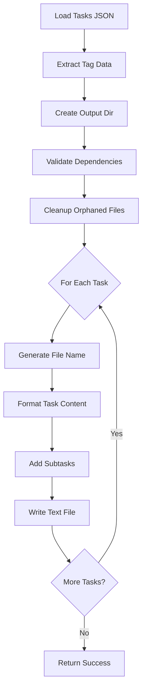

# Tool: generate

## Purpose
Generate individual task files in text format from the central tasks.json file, creating human-readable task documents for each task with full details and subtasks.

## Business Value
- **Who uses this**: Developers and project managers needing task documentation
- **What problem it solves**: Creates individual task files for easy reading, sharing, and version control tracking
- **Why it's better than manual approach**: Automatically maintains consistency between JSON data and text files, handles orphaned file cleanup, and preserves tag-specific organization

## Functionality Specification

### Input Requirements

| Parameter | Type | Required | Default | Description |
|-----------|------|----------|---------|-------------|
| `file` | string | No | ".taskmaster/tasks/tasks.json" | Path to tasks file |
| `output` | string | No | Same as tasks file directory | Output directory for task files |
| `projectRoot` | string | Yes | - | Absolute path to project directory |
| `tag` | string | No | Current tag | Tag context to operate on |

#### Validation Rules
1. `projectRoot` must be an existing directory
2. Tasks file must exist and contain valid JSON
3. Output directory will be created if it doesn't exist
4. Tag must exist in the tasks data

### Processing Logic

#### Step-by-Step Algorithm

```
1. VALIDATE_INPUTS
   - Verify projectRoot exists
   - Resolve tag (use current if not specified)
   - Find tasks.json file path
   
2. LOAD_TASK_DATA
   - Read tasks.json from specified path
   - Extract raw tagged data structure
   - Get tasks for specified tag
   - Validate tag has tasks
   
3. CREATE_OUTPUT_DIRECTORY
   - If output dir doesn't exist, create it
   - Use same directory as tasks.json if not specified
   
4. VALIDATE_DEPENDENCIES
   - Check all task dependencies
   - Fix any invalid references
   - Ensure consistency across tasks
   
5. CLEANUP_ORPHANED_FILES
   - List existing task files in output directory
   - Identify tag-specific file patterns:
      - Master tag: task_001.txt
      - Other tags: task_001_tagname.txt
   - Remove files for tasks that no longer exist
   - Only clean files for current tag
   
6. FOR EACH TASK:
   - Generate file name based on tag
   - Create text content with:
      - Task ID and title
      - Status and priority
      - Dependencies with status
      - Description and details
      - Test strategy
      - Subtasks with full details
   - Write to output file
   
7. RETURN_RESULTS
   - Report number of files generated
   - Include output directory path
   - Confirm successful generation
```

### AI Prompts Used

**This tool does not use AI**. It's a pure file generation tool that:
- Reads from JSON files
- Formats data as text
- Writes to text files
- No AI calls or prompts involved

### Output Specification

#### Success Response
```javascript
{
  success: true,
  data: {
    message: "Successfully generated task files",
    tasksPath: "/project/.taskmaster/tasks/tasks.json",
    outputDir: "/project/.taskmaster/tasks",
    taskFiles: "Individual task files have been generated in the output directory"
  }
}
```

#### Generated File Format
```text
# Task ID: 1
# Title: Implement authentication system
# Status: in-progress
# Dependencies: None
# Priority: high
# Description: Create JWT-based authentication
# Details:
Implement a secure authentication system using JWT tokens.
Include user registration, login, and logout functionality.
Support password reset and email verification.

# Test Strategy:
Unit tests for all auth functions
Integration tests for login flow
Security testing for token validation

# Subtasks:
## 1. Create user model [done]
### Dependencies: None
### Description: Define user schema and database model
### Details:
Create user schema with email, password hash, and profile fields

## 2. Implement JWT service [pending]
### Dependencies: 1.1
### Description: Create JWT token generation and validation
### Details:
Implement token generation, validation, and refresh logic
```

#### Error Response
```javascript
{
  success: false,
  error: {
    code: "MISSING_ARGUMENT",
    message: "tasksJsonPath is required but was not provided."
  }
}
```

#### Error Codes
- `MISSING_ARGUMENT`: Required parameters not provided
- `GENERATE_FILES_ERROR`: Error during file generation
- `GENERATE_TASKS_ERROR`: System error during generation

### Side Effects
1. **Creates/updates text files** in output directory
2. **Removes orphaned files** for deleted tasks
3. Validates and fixes task dependencies
4. Creates output directory if needed
5. No AI service calls

## Data Flow



## Implementation Details

### Data Storage
- **Input**: `.taskmaster/tasks/tasks.json` - Task data by tag
- **Output**: `.taskmaster/tasks/` - Individual task text files
- Files organized by tag with naming convention

### File Naming Convention
```javascript
// Master tag: simple numbering
"task_001.txt"
"task_002.txt"

// Other tags: include tag name
"task_001_feature-auth.txt"
"task_002_feature-auth.txt"
```

### Content Formatting
- Headers use `#` markdown syntax
- Subtasks use `##` for nesting
- Dependencies show IDs with status
- Multi-line content preserved
- Empty fields shown as blank

### Orphaned File Cleanup
- Only removes files for current tag
- Preserves files from other tags
- Matches file pattern exactly
- Safe deletion with error handling

### Dependency Formatting
```javascript
// Convert subtask dependencies to full notation
const subtaskDeps = subtask.dependencies
  .map(depId => 
    typeof depId === 'number' 
      ? `${task.id}.${depId}`  // Convert 2 to "1.2"
      : depId.toString()        // Keep "1.2" as is
  )
  .join(', ');
```

## AI Integration Points
**This tool has no AI integration**. It's a pure data operation that:
- Transforms JSON to text format
- Performs file I/O operations
- No model calls or prompts

## Dependencies
- **File System Access**: Read/write access to files
- **Dependency Manager**: Validates task dependencies
- **Silent Mode**: Prevents console output interference
- **Path Utils**: File path resolution

## Test Scenarios

### 1. Generate Master Tag Files
```javascript
// Test: Generate files for master tag
Input: {
  projectRoot: "/project",
  tag: "master"
}
Expected: Files named task_001.txt, task_002.txt
```

### 2. Generate Feature Tag Files
```javascript
// Test: Generate files for feature tag
Input: {
  projectRoot: "/project",
  tag: "feature-auth"
}
Expected: Files named task_001_feature-auth.txt
```

### 3. Custom Output Directory
```javascript
// Test: Generate to custom location
Input: {
  output: "/custom/output",
  projectRoot: "/project"
}
Expected: Files created in /custom/output
```

### 4. Cleanup Orphaned Files
```javascript
// Test: Remove files for deleted tasks
Setup: task_999.txt exists but task 999 deleted
Input: {
  projectRoot: "/project"
}
Expected: task_999.txt removed
```

### 5. Preserve Other Tag Files
```javascript
// Test: Don't delete files from other tags
Setup: Processing master tag, feature files exist
Input: {
  tag: "master",
  projectRoot: "/project"
}
Expected: Only master files affected
```

### 6. Handle Subtasks
```javascript
// Test: Include subtask details
Setup: Task has multiple subtasks
Input: {
  projectRoot: "/project"
}
Expected: Subtasks included with formatting
```

### 7. Empty Tasks List
```javascript
// Test: Handle tag with no tasks
Setup: Tag exists but has empty tasks array
Input: {
  tag: "empty-tag",
  projectRoot: "/project"
}
Expected: Error about no tasks found
```

### 8. Missing Output Directory
```javascript
// Test: Create output directory
Setup: Output directory doesn't exist
Input: {
  output: "/new/dir",
  projectRoot: "/project"
}
Expected: Directory created automatically
```

## Implementation Notes
- **Complexity**: Low (file I/O operations)
- **Estimated Effort**: 2-3 hours for complete implementation
- **Critical Success Factors**:
  1. Correct file naming by tag
  2. Proper orphaned file cleanup
  3. Accurate content formatting
  4. Dependency validation
  5. Error handling for file operations

## Performance Considerations
- O(n) for generating n task files
- File I/O is main bottleneck
- Consider async writes for large task lists
- Orphaned file cleanup adds overhead
- No network calls or AI operations

## Security Considerations
- Validate file paths to prevent directory traversal
- Ensure write permissions for output directory
- No external API calls
- No sensitive data exposure
- Safe file deletion with validation

## Code References
- Current implementation: `scripts/modules/task-manager/generate-task-files.js`
- MCP tool: `mcp-server/src/tools/generate.js`
- Direct function: `mcp-server/src/core/direct-functions/generate-task-files.js`
- Key functions:
  - `generateTaskFiles()`: Main generation logic
  - `validateAndFixDependencies()`: Dependency validation
  - `formatDependenciesWithStatus()`: Dependency formatting
  - File cleanup logic for orphaned files
- Design patterns: File generation pattern, cleanup pattern

---

*This documentation captures the actual current implementation of the generate tool.*