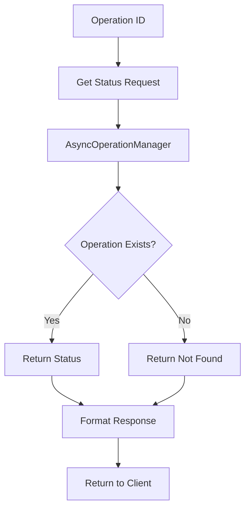

# Tool: get_operation_status

## Purpose
Retrieve the status and result/error of a background operation (currently unimplemented/inactive).

## Business Value
- **Who uses this**: Developers tracking long-running async operations
- **What problem it solves**: Would provide status updates for background tasks
- **Why it's better than manual approach**: Would enable non-blocking operation tracking

## Current Status
**⚠️ INACTIVE**: This tool exists in the codebase but is NOT registered in the MCP server. It requires AsyncOperationManager implementation which doesn't exist yet.

## Functionality Specification (Planned)

### Input Requirements

| Parameter | Type | Required | Default | Description |
|-----------|------|----------|---------|-------------|
| `operationId` | string | Yes | - | The ID of the operation to check |

#### Validation Rules
1. Operation ID must be non-empty string
2. Operation must exist in AsyncOperationManager (not implemented)

### Processing Logic (Planned)

#### Step-by-Step Algorithm

```
1. VALIDATE_INPUT
   - Check operation ID provided
   
2. GET_STATUS
   - Call asyncManager.getStatus(operationId)
   - Handle not_found status
   
3. RETURN_STATUS
   - Return operation status object
   - Include error details if failed
```

### Output Specification (Planned)

#### Success Response
```javascript
{
  success: true,
  data: {
    operationId: "op_123456",
    status: "completed", // 'pending', 'in_progress', 'completed', 'failed', 'not_found'
    result: { /* operation specific result */ },
    startedAt: "2024-01-20T10:00:00Z",
    completedAt: "2024-01-20T10:05:00Z"
  }
}
```

#### Error Response
```javascript
{
  success: false,
  error: {
    code: "OPERATION_NOT_FOUND",
    message: "Operation ID not found: op_123456"
  }
}
```

#### Error Codes
- `OPERATION_NOT_FOUND`: Operation ID doesn't exist
- `GET_STATUS_ERROR`: Failed to retrieve status

### Side Effects
None - read-only operation

## Data Flow (Planned)



## Implementation Details

### Current Implementation Status
- Tool file exists: `mcp-server/src/tools/get-operation-status.js`
- NOT registered in `mcp-server/src/tools/index.js`
- Missing dependency: AsyncOperationManager class
- No direct function implementation
- No CLI command implementation

### Required Components (Not Implemented)
1. **AsyncOperationManager class** - Would manage operation lifecycle
2. **Operation storage** - Would persist operation state
3. **Tool registration** - Add to tools/index.js
4. **Direct function** - Create core/direct-functions/get-operation-status.js

## AI Integration Points
This tool **does not use AI** - it's a pure data retrieval operation.

## Dependencies
- **AsyncOperationManager**: Not implemented
- **Operation storage**: Not implemented
- **Logger**: Standard logging

## Test Scenarios (When Implemented)

### 1. Valid Operation Status
```javascript
// Test: Check existing operation
Input: {
  operationId: "op_123456"
}
Expected: Status object with current state
```

### 2. Non-existent Operation
```javascript
// Test: Check missing operation
Input: {
  operationId: "op_nonexistent"
}
Expected: not_found status
```

### 3. Completed Operation
```javascript
// Test: Check finished operation
Input: {
  operationId: "op_completed"
}
Expected: Status with result data
```

### 4. Failed Operation
```javascript
// Test: Check failed operation
Input: {
  operationId: "op_failed"
}
Expected: Status with error details
```

## Implementation Notes
- **Complexity**: Low (when AsyncOperationManager exists)
- **Current State**: Tool exists but is inactive
- **Activation Requirements**:
  1. Implement AsyncOperationManager class
  2. Add operation storage mechanism
  3. Register tool in tools/index.js
  4. Pass asyncManager to tool registration
  5. Create direct function wrapper

## Performance Considerations
- Simple in-memory lookup (when implemented)
- No external API calls
- Instant response time expected

## Security Considerations
- Operation IDs should be unpredictable
- No sensitive data in operation IDs
- Access control per operation (future)

## Code References
- Tool implementation: `mcp-server/src/tools/get-operation-status.js` (registerGetOperationStatusTool function)
- Registration needed in: `mcp-server/src/tools/index.js`
- AsyncOperationManager: Not implemented
- Direct function: Not implemented
- CLI command: Not implemented

---

*This documentation describes a tool that exists in the codebase but is currently inactive/unimplemented.*