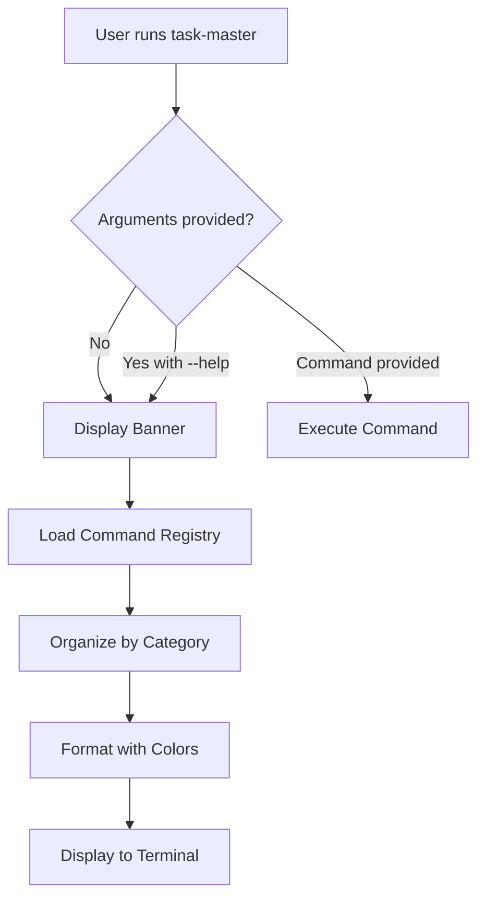

# Tool: help

## Purpose
Display comprehensive help guide showing all available Task Master commands and their usage.

## Business Value
- **Who uses this**: All Task Master users needing command reference
- **What problem it solves**: Provides quick access to command documentation and usage examples
- **Why it's better than manual approach**: Organized, categorized command listing with syntax and descriptions

## Current Status
**CLI-ONLY**: This is a CLI display function, not an MCP tool. It's invoked when running `task-master` without arguments or with `--help`.

## Functionality Specification

### Input Requirements
None - automatically triggered when:
1. Running `task-master` with no arguments
2. Running `task-master --help`
3. Running `task-master <command> --help` for specific command help

### Processing Logic

#### Step-by-Step Algorithm

```
1. DISPLAY_BANNER
   - Show Task Master ASCII banner
   
2. ORGANIZE_COMMANDS
   - Group commands by category
   - Format command syntax
   - Add descriptions
   
3. DISPLAY_CATEGORIES
   Categories shown:
   - Project Setup & Configuration
   - Task Management & Creation
   - Task Analysis & Expansion
   - Task Status & Viewing
   - Task Organization
   - Dependency Management
   - Tag Management
   - AI Research Features
   - Task Migration & Sync
   
4. FORMAT_OUTPUT
   - Color-coded sections
   - Boxed formatting
   - Terminal width detection
```

### Output Specification

The help display includes:

1. **Project Setup & Configuration**
   - `init` - Initialize project
   - `models` - View/configure AI models
   - `models --setup` - Interactive model setup
   - `models --set-main` - Set primary model
   - `models --set-research` - Set research model
   - `models --set-fallback` - Set fallback model

2. **Task Management & Creation**
   - `parse-prd` - Generate tasks from PRD
   - `add-task` - Add new task
   - `add-subtask` - Add subtask
   - `update` - Update multiple tasks
   - `update-task` - Update single task
   - `update-subtask` - Update subtask
   - `remove-task` - Remove task
   - `remove-subtask` - Remove subtask
   - `clear-subtasks` - Clear all subtasks

3. **Task Analysis & Expansion**
   - `analyze-complexity` - Analyze task complexity
   - `expand` - Expand task into subtasks
   - `expand-all` - Expand all eligible tasks
   - `scope-up` - Increase task scope
   - `scope-down` - Decrease task scope
   - `complexity-report` - View complexity analysis

4. **Task Status & Viewing**
   - `list` - List all tasks
   - `show` - Show task details
   - `next` - Get next available task
   - `set-status` - Update task status
   - `generate` - Generate task markdown files

5. **Task Organization**
   - `move` - Move tasks between positions

6. **Dependency Management**
   - `add-dependency` - Add task dependency
   - `remove-dependency` - Remove dependency
   - `validate-dependencies` - Check dependencies
   - `fix-dependencies` - Repair dependency issues

7. **Tag Management**
   - `tags` - List all tags
   - `add-tag` - Create new tag
   - `delete-tag` - Delete tag
   - `use-tag` - Switch tag context
   - `rename-tag` - Rename tag
   - `copy-tag` - Duplicate tag

8. **AI Research Features**
   - `research` - AI-powered research query

9. **Task Migration & Sync**
   - `migrate` - Migrate old format
   - `sync-readme` - Sync tasks to README

### Side Effects
None - display only

## Data Flow



## Implementation Details

### Display Features
- **Color coding** by command category
- **Terminal width detection** for responsive layout
- **Boxed formatting** using boxen
- **Gradient text** for banner
- **Examples** and **syntax** for each command
- **Tips section** with best practices
- **Legend** for common flags

### Command Categories
Commands are organized into logical groups:
1. Setup and initialization
2. Task creation and modification
3. Analysis and planning
4. Status and viewing
5. Organization and structure
6. Dependencies
7. Tags for parallel workflows
8. AI features
9. Migration and sync

## AI Integration Points
This tool **does not use AI** - it's a static help display.

## Dependencies
- **UI module**: displayHelp function
- **Commander.js**: Command registration
- **Chalk**: Terminal colors
- **Boxen**: Box formatting
- **Figlet**: ASCII banner

## Test Scenarios

### 1. No Arguments
```bash
# Test: Run without arguments
$ task-master
Expected: Display banner and full help
```

### 2. Help Flag
```bash
# Test: Run with help flag
$ task-master --help
Expected: Display banner and full help
```

### 3. Command Help
```bash
# Test: Get help for specific command
$ task-master parse-prd --help
Expected: Display command-specific help
```

## Implementation Notes
- **Complexity**: Low (display function)
- **Location**: `scripts/modules/ui.js` (displayHelp function)
- **Entry point**: `bin/task-master.js`
- **Not an MCP tool**: CLI-only functionality

## Performance Considerations
- Instant display
- No external calls
- Terminal width detection for layout

## Security Considerations
- No data access
- Read-only operation
- No sensitive information exposed

## Code References
- UI implementation: `scripts/modules/ui.js:532` (displayHelp function)
- CLI entry: `bin/task-master.js:369-372` (invocation logic)
- Command registration: `scripts/modules/commands.js` (command definitions)
- No MCP tool implementation
- No direct function implementation

---

*This documentation describes a CLI-only help display function, not an MCP tool.*