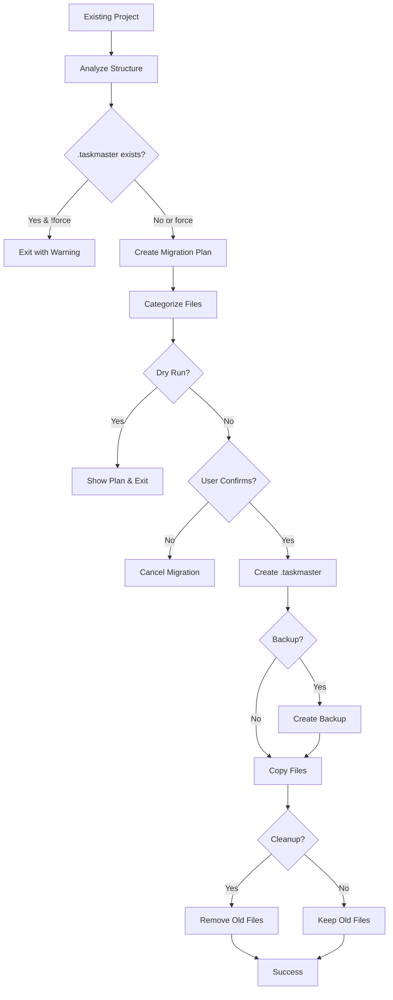

# Tool: migrate

## Purpose
Migrate existing Task Master projects from old directory structure to the new .taskmaster centralized structure.

## Business Value
- **Who uses this**: Developers with legacy Task Master projects
- **What problem it solves**: Upgrades projects to use the new standardized .taskmaster directory structure
- **Why it's better than manual approach**: Automated migration with backup options and intelligent file categorization

## Current Status
**CLI-ONLY**: This is a CLI command, not an MCP tool. Run with `task-master migrate`.

## Functionality Specification

### Input Requirements

| Parameter | Type | Required | Default | Description |
|-----------|------|----------|---------|-------------|
| `--force` | boolean | No | false | Force migration even if .taskmaster exists |
| `--backup` | boolean | No | false | Create backup before migration |
| `--cleanup` | boolean | No | true | Remove old files after migration |
| `--yes` | boolean | No | false | Skip confirmation prompts |
| `--dry-run` | boolean | No | false | Preview migration without changes |

#### Validation Rules
1. Check if .taskmaster directory already exists
2. Analyze existing project structure
3. Create migration plan
4. Confirm with user unless --yes flag

### Processing Logic

#### Step-by-Step Algorithm

```
1. ANALYZE_PROJECT
   - Check for existing .taskmaster directory
   - If exists and !force, warn and exit
   
2. CREATE_MIGRATION_PLAN
   - Scan for old structure:
     * tasks/ directory
     * scripts/ directory files
     * .taskmasterconfig file
   - Categorize files:
     * tasks/* → .taskmaster/tasks/*
     * scripts/*example* → .taskmaster/templates/*
     * scripts/*complexity-report* → .taskmaster/reports/*
     * scripts/*.md|.txt → .taskmaster/docs/*
     * .taskmasterconfig → .taskmaster/config.json
   
3. SHOW_MIGRATION_PLAN
   - Display what will be moved
   - If dry-run, exit here
   
4. CONFIRM_MIGRATION
   - Unless --yes, ask for confirmation
   - Exit if user declines
   
5. PERFORM_MIGRATION
   - Create .taskmaster directory structure
   - Create only needed subdirectories
   - If backup, create .taskmaster-migration-backup
   - Copy files to new locations
   - If cleanup, remove old files
   
6. CLEANUP
   - If cleanup, remove empty directories
   - Report success
```

### Output Specification

#### Success Response
```
ℹ Starting migration in: /project
ℹ Migration plan:
  Will move: tasks/task-1.md → .taskmaster/tasks/task-1.md
  Will move: scripts/example_prd.txt → .taskmaster/templates/example_prd.txt
  Will move: scripts/prd.txt → .taskmaster/docs/prd.txt
  Will move: .taskmasterconfig → .taskmaster/config.json
ℹ Created directory: .taskmaster/tasks
ℹ Created directory: .taskmaster/templates
ℹ Created directory: .taskmaster/docs
ℹ Migrated: tasks/task-1.md → .taskmaster/tasks/task-1.md
ℹ Migrated: scripts/example_prd.txt → .taskmaster/templates/example_prd.txt
ℹ Migrated: scripts/prd.txt → .taskmaster/docs/prd.txt
ℹ Migrated: .taskmasterconfig → .taskmaster/config.json
✓ Migration completed successfully!
ℹ You can now use the new .taskmaster directory structure.
```

#### Error Response
```
✗ Migration failed: [error message]
```

### Side Effects
1. **Creates .taskmaster directory structure**
2. **Moves/copies files to new locations**
3. **May delete old files** (if --cleanup)
4. **Creates backup** (if --backup)

## Data Flow



## Implementation Details

### File Categorization Logic
```javascript
// Template/example files
if (includes('example') || includes('template') || 
    includes('boilerplate') || includes('sample')) {
  → .taskmaster/templates/
}

// Complexity reports
else if (includes('complexity') && includes('report') && 
         endsWith('.json')) {
  → .taskmaster/reports/
}

// Documentation
else if (includes('prd') || endsWith('.md') || endsWith('.txt')) {
  → .taskmaster/docs/
}

// Uncertain files
else {
  → Skip with warning
}
```

### Directory Structure Created
```
.taskmaster/
├── tasks/          # Task files
├── docs/           # Documentation
├── templates/      # Example files
├── reports/        # Analysis reports
└── config.json     # Configuration
```

## AI Integration Points
This tool **does not use AI** - it's a pure file system migration operation.

## Dependencies
- **File System**: fs module for file operations
- **Path**: path module for path manipulation
- **Chalk**: Terminal colors
- **Readline**: User confirmation prompts

## Test Scenarios

### 1. Fresh Migration
```bash
# Test: Migrate project with no .taskmaster
$ task-master migrate
Expected: Creates .taskmaster and migrates files
```

### 2. Force Migration
```bash
# Test: Migrate when .taskmaster exists
$ task-master migrate --force
Expected: Overwrites existing structure
```

### 3. Dry Run
```bash
# Test: Preview migration
$ task-master migrate --dry-run
Expected: Shows plan without changes
```

### 4. With Backup
```bash
# Test: Create backup before migration
$ task-master migrate --backup
Expected: Creates .taskmaster-migration-backup
```

### 5. No Cleanup
```bash
# Test: Keep old files
$ task-master migrate --cleanup=false
Expected: Copies files without removing originals
```

### 6. Auto-confirm
```bash
# Test: Skip confirmation
$ task-master migrate --yes
Expected: Migrates without prompting
```

## Implementation Notes
- **Complexity**: Low (file system operations)
- **Location**: `scripts/modules/task-manager/migrate.js`
- **Entry point**: CLI command registration
- **Not an MCP tool**: CLI-only functionality

## Performance Considerations
- Fast file system operations
- No network calls
- Linear time based on file count

## Security Considerations
- Local file operations only
- Preserves file permissions
- Optional backup for safety

## Code References
- Implementation: `scripts/modules/task-manager/migrate.js` (migrateProject function)
- CLI registration: `scripts/modules/commands.js:4720`
- No MCP tool implementation
- No direct function wrapper
- Key functions:
  - `migrateProject()`: Main migration logic
  - `analyzeMigrationNeeds()`: Creates migration plan
  - `performMigration()`: Executes file moves

---

*This documentation describes a CLI-only migration utility, not an MCP tool.*