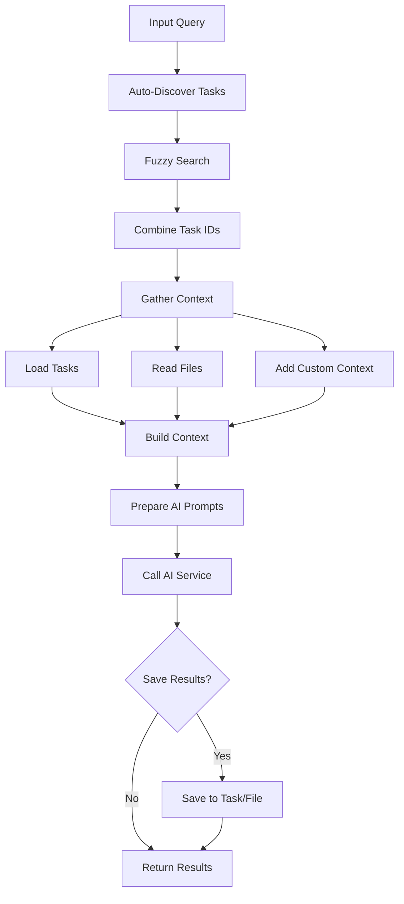

# Tool: research

## Purpose
Perform AI-powered research queries with intelligent project context gathering and auto-discovery of relevant tasks.

## Business Value
- **Who uses this**: Developers needing quick answers about project implementation, architecture, or best practices
- **What problem it solves**: Provides contextual AI assistance that understands the specific project and tasks
- **Why it's better than manual approach**: Automatically gathers relevant context, discovers related tasks, and provides tailored answers

## Functionality Specification

### Input Requirements

| Parameter | Type | Required | Default | Description |
|-----------|------|----------|---------|-------------|
| `query` | string | Yes | - | Research query/prompt |
| `taskIds` | string | No | - | Comma-separated list of task/subtask IDs (e.g., "15,16.2,17") |
| `filePaths` | string | No | - | Comma-separated list of file paths (e.g., "src/api.js,docs/readme.md") |
| `customContext` | string | No | - | Additional custom context text |
| `includeProjectTree` | boolean | No | false | Include project file tree structure |
| `detailLevel` | string | No | "medium" | Response detail: "low", "medium", "high" |
| `saveTo` | string | No | - | Auto-save to task/subtask ID (e.g., "15" or "15.2") |
| `saveToFile` | boolean | No | false | Save to .taskmaster/docs/research/ directory |
| `projectRoot` | string | Yes | - | Absolute path to project directory |
| `tag` | string | No | Current tag | Tag context to operate on |

#### Validation Rules
1. Query must be non-empty string
2. Detail level must be "low", "medium", or "high"
3. Task IDs must be valid format if provided
4. File paths resolved relative to project root
5. SaveTo must be valid task/subtask ID if provided

### Processing Logic

#### Step-by-Step Algorithm

```
1. VALIDATE_QUERY
   - Check query provided and non-empty
   - Validate detail level
   
2. AUTO_DISCOVER_TASKS
   - Use fuzzy search on query
   - Find up to 8 relevant tasks
   - Combine with provided task IDs
   - Remove duplicates
   
3. GATHER_CONTEXT
   - Load specified task content
   - Read specified files
   - Add custom context
   - Include project tree if requested
   - Count tokens for each section
   
4. PREPARE_AI_PROMPTS
   - Load research prompt template
   - Inject query and context
   - Apply detail level formatting
   - Count prompt tokens
   
5. CALL_AI_SERVICE
   - Use research model
   - Pass system and user prompts
   - Get research response
   
6. SAVE_RESULTS (Optional)
   If saveTo provided:
   - Format research output
   - Append to task/subtask
   If saveToFile:
   - Save to research directory
   
7. RETURN_RESULTS
   - Research response
   - Token counts
   - Telemetry data
```

### Output Specification

#### Success Response
```javascript
{
  success: true,
  data: {
    query: "How should I implement authentication?",
    result: "Based on your project context...",
    contextSize: 4500,
    contextTokens: 1200,
    tokenBreakdown: {
      tasks: 500,
      files: 400,
      customContext: 100,
      projectTree: 200,
      total: 1200
    },
    systemPromptTokens: 450,
    userPromptTokens: 1650,
    totalInputTokens: 2100,
    detailLevel: "medium",
    telemetryData: { ... },
    savedFilePath: "/project/.taskmaster/docs/research/research-2024-01-20-143022.md"
  }
}
```

#### Error Response
```javascript
{
  success: false,
  error: {
    code: "MISSING_PARAMETER",
    message: "The query parameter is required and must be a non-empty string"
  }
}
```

#### Error Codes
- `MISSING_PARAMETER`: Query not provided
- `INVALID_PARAMETER`: Invalid detail level
- `RESEARCH_ERROR`: AI service error
- `SAVE_ERROR`: Failed to save results

### Side Effects
1. **May update tasks** if saveTo is provided
2. **Creates research file** if saveToFile is true
3. Uses AI API credits
4. Logs telemetry data
5. Auto-discovers related tasks

## Data Flow



## Implementation Details

### AI Prompt Structure

#### System Prompt (EXACT):
```
You are an expert AI research assistant helping with a software development project. You have access to project context including tasks, files, and project structure.

Your role is to provide comprehensive, accurate, and actionable research responses based on the user's query and the provided project context.
{{#if (eq detailLevel "low")}}
**Response Style: Concise & Direct**
- Provide brief, focused answers (2-4 paragraphs maximum)
- Focus on the most essential information
- Use bullet points for key takeaways
- Avoid lengthy explanations unless critical
- Skip pleasantries, introductions, and conclusions
- No phrases like "Based on your project context" or "I'll provide guidance"
- No summary outros or alignment statements
- Get straight to the actionable information
- Use simple, direct language - users want info, not explanation{{/if}}{{#if (eq detailLevel "medium")}}
**Response Style: Balanced & Comprehensive**
- Provide thorough but well-structured responses (4-8 paragraphs)
- Include relevant examples and explanations
- Balance depth with readability
- Use headings and bullet points for organization{{/if}}{{#if (eq detailLevel "high")}}
**Response Style: Detailed & Exhaustive**
- Provide comprehensive, in-depth analysis (8+ paragraphs)
- Include multiple perspectives and approaches
- Provide detailed examples, code snippets, and step-by-step guidance
- Cover edge cases and potential pitfalls
- Use clear structure with headings, subheadings, and lists{{/if}}

**Guidelines:**
- Always consider the project context when formulating responses
- Reference specific tasks, files, or project elements when relevant
- Provide actionable insights that can be applied to the project
- If the query relates to existing project tasks, suggest how the research applies to those tasks
- Use markdown formatting for better readability
- Be precise and avoid speculation unless clearly marked as such
{{#if (eq detailLevel "low")}}
**For LOW detail level specifically:**
- Start immediately with the core information
- No introductory phrases or context acknowledgments
- No concluding summaries or project alignment statements
- Focus purely on facts, steps, and actionable items{{/if}}
```

#### User Prompt (EXACT):
```
# Research Query

{{query}}
{{#if gatheredContext}}

# Project Context

{{gatheredContext}}
{{/if}}

# Instructions

Please research and provide a {{detailLevel}}-detail response to the query above. Consider the project context provided and make your response as relevant and actionable as possible for this specific project.
```

### Fuzzy Search Algorithm
```javascript
// Auto-discovers up to 8 relevant tasks
const searchResults = fuzzySearch.findRelevantTasks(query, {
  maxResults: 8,
  includeRecent: true,
  includeCategoryMatches: true
});
```

### Context Gathering
- Tasks: Full task details including subtasks
- Files: Complete file contents
- Custom: User-provided additional context
- Project Tree: Directory structure (optional)

### Token Counting
Breaks down tokens by:
- Task content
- File content
- Custom context
- Project tree
- System prompt
- User prompt

## AI Integration Points
This tool **uses AI extensively**:
- Research model for generating responses
- Fuzzy search for task discovery
- Context-aware responses
- Prompt template with detail levels
- Token counting for optimization

## Dependencies
- **AI Service**: Research model configuration
- **Context Gatherer**: Project context assembly
- **Fuzzy Search**: Task relevance matching
- **Prompt Manager**: Template loading
- **File System**: Reading files and saving results
- **Task Manager**: Task updates for saveTo

## Test Scenarios

### 1. Basic Research Query
```javascript
// Test: Simple question
Input: {
  projectRoot: "/project",
  query: "How should I implement authentication?"
}
Expected: AI response with auto-discovered auth tasks
```

### 2. With Specific Tasks
```javascript
// Test: Targeted research
Input: {
  projectRoot: "/project",
  query: "What's the status of login implementation?",
  taskIds: "15,15.1,15.2"
}
Expected: Response focused on specified tasks
```

### 3. With File Context
```javascript
// Test: File-based research
Input: {
  projectRoot: "/project",
  query: "Explain the API structure",
  filePaths: "src/api/index.js,src/api/auth.js"
}
Expected: Response analyzing specified files
```

### 4. Low Detail Level
```javascript
// Test: Concise response
Input: {
  projectRoot: "/project",
  query: "What databases are supported?",
  detailLevel: "low"
}
Expected: Brief 2-4 paragraph response
```

### 5. High Detail Level
```javascript
// Test: Comprehensive response
Input: {
  projectRoot: "/project",
  query: "Design a caching strategy",
  detailLevel: "high"
}
Expected: Detailed 8+ paragraph analysis
```

### 6. Save to Task
```javascript
// Test: Auto-save to task
Input: {
  projectRoot: "/project",
  query: "Research OAuth providers",
  saveTo: "15.2"
}
Expected: Research appended to subtask 15.2
```

### 7. Save to File
```javascript
// Test: File output
Input: {
  projectRoot: "/project",
  query: "Architecture review",
  saveToFile: true
}
Expected: File created in research directory
```

### 8. With Project Tree
```javascript
// Test: Include structure
Input: {
  projectRoot: "/project",
  query: "Where should I add new components?",
  includeProjectTree: true
}
Expected: Response considers project structure
```

## Implementation Notes
- **Complexity**: High (AI integration, context gathering)
- **Estimated Effort**: 6-8 hours for complete implementation
- **Critical Success Factors**:
  1. Effective fuzzy search for task discovery
  2. Optimal context gathering
  3. Prompt template detail levels
  4. Token counting accuracy
  5. Result saving mechanisms

## Performance Considerations
- AI API call latency (1-5 seconds typical)
- Context gathering can be memory intensive
- Token limits must be respected
- Fuzzy search performance on large task lists
- File reading for large codebases

## Security Considerations
- API keys must be configured
- File path validation required
- No execution of research results
- Sanitize file paths in output
- Rate limiting on AI calls

## Code References
- Current implementation: `scripts/modules/task-manager/research.js` (performResearch function)
- MCP tool: `mcp-server/src/tools/research.js`
- Direct function: `mcp-server/src/core/direct-functions/research.js`
- Prompt template: `src/prompts/research.json`
- Key functions:
  - `performResearch()`: Main research logic
  - `FuzzyTaskSearch.findRelevantTasks()`: Task discovery
  - `ContextGatherer.gather()`: Context assembly
  - `generateTextService()`: AI service call
  - `handleFollowUpQuestions()`: CLI interaction
- Design patterns: Strategy pattern (detail levels), Template pattern (prompts)

---

*This documentation captures the actual current implementation of the research tool as an AI-powered contextual assistant.*