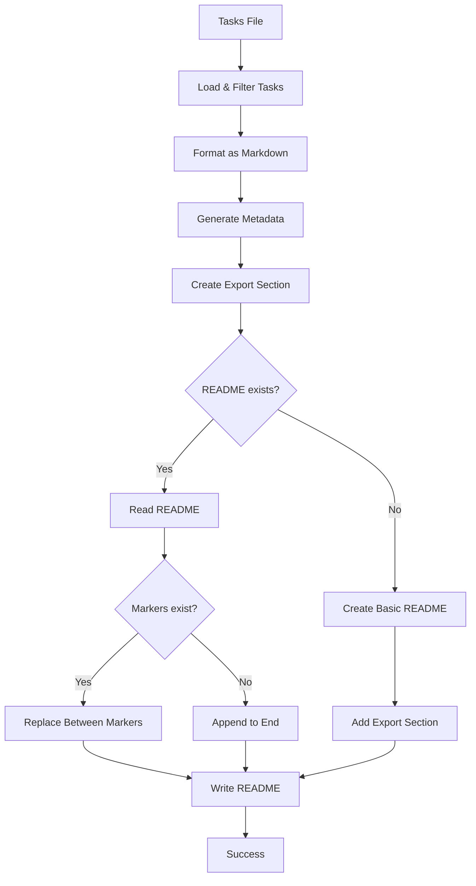

# Tool: sync_readme

## Purpose
Synchronize the current task list to README.md in the project root for visibility and documentation.

## Business Value
- **Who uses this**: Development teams sharing project progress
- **What problem it solves**: Keeps README.md updated with current task status for project transparency
- **Why it's better than manual approach**: Automated task export with consistent formatting and metadata

## Current Status
**CLI-ONLY**: This is a CLI command, not an MCP tool. Run with `task-master sync-readme`.

## Functionality Specification

### Input Requirements

| Parameter | Type | Required | Default | Description |
|-----------|------|----------|---------|-------------|
| `--file` | string | No | .taskmaster/tasks/tasks.json | Path to tasks file |
| `--with-subtasks` | boolean | No | false | Include subtasks in output |
| `--status` | string | No | - | Filter by status (pending, done, etc.) |
| `--tag` | string | No | master | Tag to use for task list |

#### Validation Rules
1. Tasks file must exist
2. Valid status values if provided
3. README.md writable at project root

### Processing Logic

#### Step-by-Step Algorithm

```
1. LOAD_TASKS
   - Read tasks from specified file
   - Apply status filter if provided
   - Apply tag filter if provided
   
2. FORMAT_TASKS
   - Use markdown-readme format
   - Include/exclude subtasks based on flag
   - Generate task hierarchy
   
3. CREATE_METADATA
   - Generate timestamp
   - Create UTM tracking URL
   - Format export information
   
4. PREPARE_MARKERS
   - Create start marker with metadata:
     * Timestamp
     * Export options (subtasks, status)
     * Powered by link with UTM tracking
   - Create end marker
   
5. UPDATE_README
   - Read existing README.md
   - If doesn't exist, create basic structure
   - Find existing export markers
   - Replace content between markers
   - Or append if no markers found
   
6. WRITE_README
   - Save updated content
   - Report success
```

### Output Specification

#### README Section Format
```markdown
<!-- TASKMASTER_EXPORT_START -->
> 🎯 **Taskmaster Export** - 2024-01-20 10:30:00 UTC
> 📋 Export: without subtasks • Status filter: none
> 🔗 Powered by [Task Master](https://task-master.dev?utm_source=github-readme&utm_medium=readme-export&utm_campaign=my-project&utm_content=task-export-link)

## 📋 Task List

- [ ] **Task 1**: Implement user authentication (pending)
- [x] **Task 2**: Set up database schema (done)
- [ ] **Task 3**: Create API endpoints (in-progress)

> 📋 **End of Taskmaster Export** - Tasks are synced from your project using the `sync-readme` command.
<!-- TASKMASTER_EXPORT_END -->
```

#### Success Response
```
✅ Successfully synced tasks to README.md
📋 Export details: without subtasks
📍 Location: /project/README.md
```

#### Error Response
```
❌ Failed to sync tasks to README: [error message]
```

### Side Effects
1. **Creates/updates README.md** at project root
2. **Preserves existing README content** outside markers
3. **Adds UTM tracking** to Task Master links

## Data Flow



## Implementation Details

### UTM Tracking
```javascript
// Creates tracking URL for analytics
function createTaskMasterUrl(projectRoot) {
  const folderName = path.basename(projectRoot);
  const cleanFolderName = folderName
    .toLowerCase()
    .replace(/[^a-z0-9]/g, '-');
  
  const utmParams = new URLSearchParams({
    utm_source: 'github-readme',
    utm_medium: 'readme-export',
    utm_campaign: cleanFolderName,
    utm_content: 'task-export-link'
  });
  
  return `https://task-master.dev?${utmParams.toString()}`;
}
```

### Marker System
- Start marker: `<!-- TASKMASTER_EXPORT_START -->`
- End marker: `<!-- TASKMASTER_EXPORT_END -->`
- Content between markers is replaced on each sync
- Preserves all other README content

### Task Formatting
- Uses checkbox format: `- [ ]` for pending, `- [x]` for done
- Bold task IDs and titles
- Shows status in parentheses
- Indents subtasks when included

## AI Integration Points
This tool **does not use AI** - it's a pure data export operation.

## Dependencies
- **File System**: fs module for file operations
- **Path**: path module for path manipulation
- **List Tasks**: Internal module for task formatting
- **Config Manager**: Project name retrieval
- **Chalk**: Terminal colors

## Test Scenarios

### 1. First Sync
```bash
# Test: Sync to new README
$ task-master sync-readme
Expected: Creates README with task section
```

### 2. Update Existing
```bash
# Test: Update existing README
$ task-master sync-readme
Expected: Replaces content between markers
```

### 3. With Subtasks
```bash
# Test: Include subtasks
$ task-master sync-readme --with-subtasks
Expected: Shows hierarchical task structure
```

### 4. Status Filter
```bash
# Test: Filter by status
$ task-master sync-readme --status=pending
Expected: Shows only pending tasks
```

### 5. Custom File
```bash
# Test: Use different tasks file
$ task-master sync-readme --file=custom-tasks.json
Expected: Reads from specified file
```

### 6. Tag Filter
```bash
# Test: Use specific tag
$ task-master sync-readme --tag=feature-branch
Expected: Shows tasks from specified tag
```

## Implementation Notes
- **Complexity**: Low (file operations and formatting)
- **Location**: `scripts/modules/sync-readme.js`
- **Entry point**: CLI command registration
- **Not an MCP tool**: CLI-only functionality

## Performance Considerations
- Fast file operations
- No network calls (except user clicking links)
- Linear time based on task count

## Security Considerations
- Local file operations only
- No sensitive data exposure
- UTM tracking for analytics only

## Code References
- Implementation: `scripts/modules/sync-readme.js` (syncTasksToReadme function)
- CLI registration: `scripts/modules/commands.js:4754`
- No MCP tool implementation
- No direct function wrapper
- Key functions:
  - `syncTasksToReadme()`: Main sync logic
  - `createStartMarker()`: Metadata generation
  - `createTaskMasterUrl()`: UTM tracking
  - `createBasicReadme()`: README template

---

*This documentation describes a CLI-only README synchronization utility, not an MCP tool.*